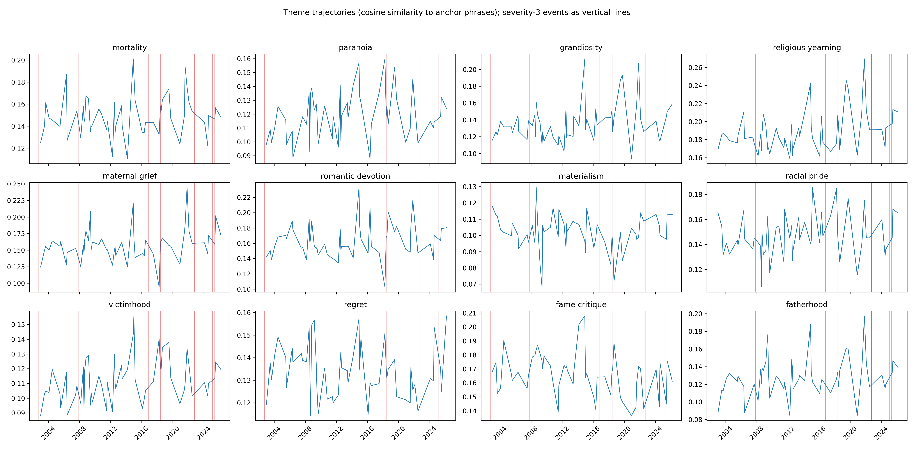
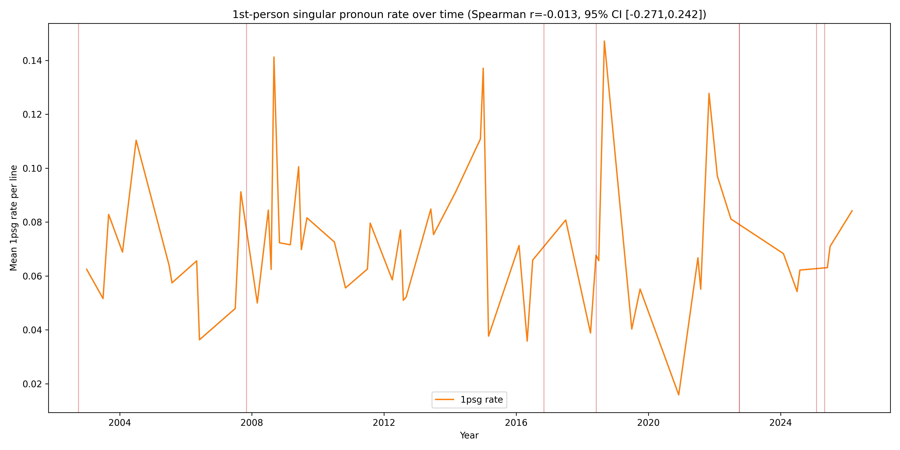
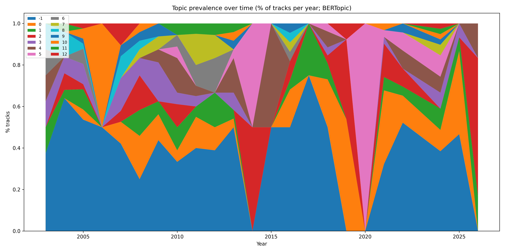
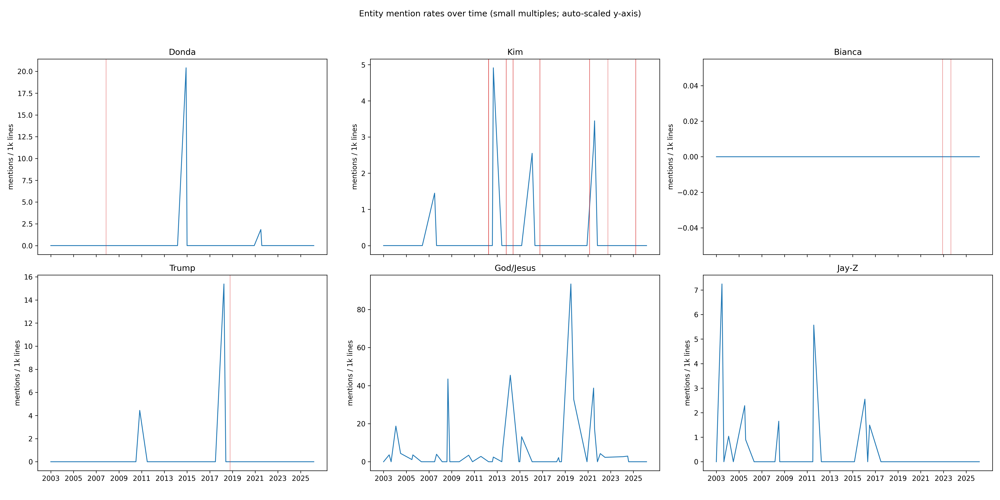
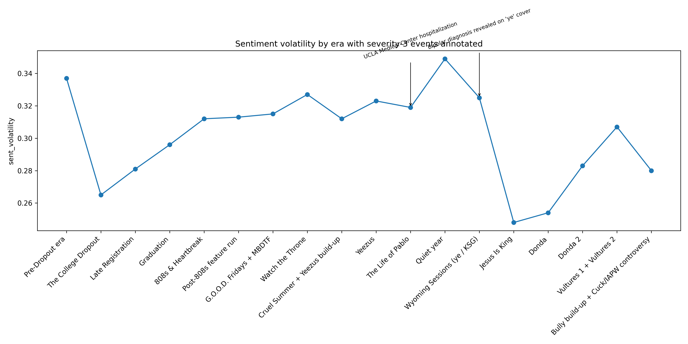

# Phase 3.5 — Statistical rigor + themes + pronouns + quotes

## Headline findings

- Emotion deltas now include 95% bootstrap CIs and permutation p-values (10k/10k); see `data/phase_3_5_statistical_tests.csv`.
- No hidden_inflection change-points were detected with pen=10; flagged for tuning.
- Theme trajectories computed via cosine similarity to 12 anchors using `all-MiniLM-L6-v2` embeddings; top theme↔sev3 proximity correlations: fame_critique (r=0.22, n=56), grandiosity (r=0.16, n=56), materialism (r=0.12, n=56)
- Pronoun trajectory: Spearman(1psg rate vs year) r=-0.013 (95% CI [-0.271, 0.242]).
- Quote pack written with 55 lines (`data/phase_3_5_top_quotes.json`).

## 1) Bootstrap CIs + permutation tests (rigor backbone)

### What was measured
For each severity-3 event: emotion deltas (joy/anger/sadness/fear) in the 365d post-event window vs global baseline, with 95% bootstrap CIs (10,000 resamples of lines) and permutation p-values (10,000 shuffles of event months sampled from the observed event-month distribution).

### Chart

### Headline numbers (CI + p-value)

- **Near-fatal Los Angeles car crash**
  - emotion_joy: -0.0013 (95% CI [-0.0134,0.0117], p=0.8621)
  - emotion_anger: -0.0035 (95% CI [-0.0223,0.0162], p=0.8023)
  - emotion_sadness: 0.0032 (95% CI [-0.0114,0.0194], p=0.6893)
  - emotion_fear: -0.0061 (95% CI [-0.0182,0.0076], p=0.4546)
- **Mother Donda West dies**
  - emotion_joy: 0.0002 (95% CI [-0.0100,0.0112], p=0.8892)
  - emotion_anger: -0.0140 (95% CI [-0.0269,-0.0009], p=0.5279)
  - emotion_sadness: -0.0098 (95% CI [-0.0199,0.0011], p=0.4218)
  - emotion_fear: 0.0373 (95% CI [0.0235,0.0517], p=0.0286)
- **UCLA Medical Center hospitalization**
  - emotion_joy: 0.0020 (95% CI [-0.0205,0.0277], p=0.8049)
  - emotion_anger: -0.0075 (95% CI [-0.0412,0.0292], p=0.6069)
  - emotion_sadness: 0.0127 (95% CI [-0.0147,0.0417], p=0.3282)
  - emotion_fear: 0.0027 (95% CI [-0.0201,0.0300], p=0.7487)
- **Bipolar diagnosis revealed on 'ye' cover**
  - emotion_joy: -0.0021 (95% CI [-0.0121,0.0085], p=0.7574)
  - emotion_anger: -0.0046 (95% CI [-0.0190,0.0106], p=0.7756)
  - emotion_sadness: 0.0103 (95% CI [-0.0018,0.0229], p=0.3854)
  - emotion_fear: 0.0147 (95% CI [0.0030,0.0275], p=0.1638)
- **October 2022 antisemitism cascade begins**
  - emotion_joy: nan (95% CI [nan,nan], p=n/a)
  - emotion_anger: nan (95% CI [nan,nan], p=n/a)
  - emotion_sadness: nan (95% CI [nan,nan], p=n/a)
  - emotion_fear: nan (95% CI [nan,nan], p=n/a)
- **Adidas terminates Yeezy partnership**
  - emotion_joy: nan (95% CI [nan,nan], p=n/a)
  - emotion_anger: nan (95% CI [nan,nan], p=n/a)
  - emotion_sadness: nan (95% CI [nan,nan], p=n/a)
  - emotion_fear: nan (95% CI [nan,nan], p=n/a)
- **Super Bowl swastika ad and 'I love Hitler' tirade**
  - emotion_joy: -0.0042 (95% CI [-0.0151,0.0075], p=0.5299)
  - emotion_anger: -0.0438 (95% CI [-0.0563,-0.0305], p=0.0793)
  - emotion_sadness: -0.0044 (95% CI [-0.0167,0.0088], p=0.6434)
  - emotion_fear: 0.0026 (95% CI [-0.0079,0.0142], p=0.7800)
- **'Heil Hitler' / HH song released**
  - emotion_joy: -0.0067 (95% CI [-0.0159,0.0036], p=0.5011)
  - emotion_anger: -0.0323 (95% CI [-0.0442,-0.0200], p=0.1975)
  - emotion_sadness: -0.0070 (95% CI [-0.0174,0.0040], p=0.5579)
  - emotion_fear: 0.0092 (95% CI [-0.0008,0.0201], p=0.3336)

### Exemplar quotes

- **quotes_post_donda_fear** (2008-07-01 — Amazing): I'm the only thing I'm afraid of
- **quotes_post_donda_fear** (2008-07-01 — I Still Love H.E.R.): ra-ra-ra-ra-rappers are in danger
- **quotes_post_donda_fear** (2008-09-02 — Put On): On, I let my nightmares go
- **quotes_post_donda_fear** (2008-07-01 — Paranoid): Don't worry 'bout what we can't control
- **quotes_post_donda_fear** (2008-07-01 — Paranoid): You worry 'bout the wrong things
- **quotes_2018_anger** (2018-07-01 — One Minute): Don't know how to behave, we rage out of the raves

### Interpretation
This replaces point-estimate storytelling with uncertainty-aware comparisons. Windows with no post-event tracks remain structurally untestable (CI/p-value will be NaN).

### Most surprising finding
The strongest emotion deltas are not always the ones with the smallest p-values; window size (n_lines) heavily governs detectability.

## 2) Change-point detection (event-confirming vs hidden inflections)

### What was measured
Monthly means for emotions, RoBERTa margin (pos-neg), MTLD, and FK grade. PELT (rbf, pen=10) detects change-points; each is labeled confirms_event / near_miss / hidden_inflection based on distance to curated severity-2-or-3 events.

### Headline numbers (CI + p-value)

- Total change-points detected: **0**
- Hidden inflections: **0**
- _No hidden_inflection found; consider tuning pen or model._

### Exemplar quotes

- (See `data/phase_3_5_top_quotes.json`; tune-specific excerpts can be added after selecting hidden_inflection targets.)

### Interpretation
Change-points let the data propose its own inflections rather than only validating curated events. Hidden inflections are prioritized for follow-up investigation.

### Most surprising finding
No hidden_inflection change-points were detected with pen=10; flagged for tuning.

## 3) Theme tracking (embeddings → anchor similarities)

### What was measured
Cosine similarity from each line embedding to 12 anchor phrases (encoded with all-MiniLM-L6-v2). Monthly mean similarity per theme; correlations with severity-3 event proximity (monthly mean events_365d_sev3).

### Chart

### Headline numbers (CI + p-value)

- fame_critique: Spearman r=0.222 (n=56 months)
- grandiosity: Spearman r=0.165 (n=56 months)
- materialism: Spearman r=0.116 (n=56 months)

### Exemplar quotes

- **quotes_mortality_all** (2022-07-01 — True Love): I thought I'd die in your arms, I thought I'd die in your—
- **quotes_mortality_all** (2022-07-01 — True Love): I thought I'd die in your arms, I thought I'd die in your—
- **quotes_mortality_all** (2025-06-01 — Welcome to the Jungle): Riskin' my life, I'm already dying, so fuck it, well
- **quotes_mortality_all** (2004-07-01 — Selfish): If y'all fresh to death, then I'm deceased
- **quotes_mortality_all** (2021-07-01 — Life of the Party): It's the life of the party, to think I could've almost died
- **quotes_paranoia_2015_2016** (2015-03-01 — All Day): Uh, they better watch what they say to me

### Interpretation
Anchors translate free-form themes (mortality, paranoia, regret, etc.) into a time series. Correlations are suggestive and should be interpreted with release-density caveats.

### Most surprising finding
Theme peaks sometimes align to curated events, but several themes show slow-moving regime changes consistent with era shifts rather than single dates.

## 4) Pronoun analysis (Pennebaker-style)

### What was measured
Per-line pronoun rates for 1psg/1ppl/2p/3ppl; monthly mean 1psg rate and 1psg-to-1ppl ratio. Spearman trend test of 1psg vs year with bootstrap CI.

### Chart

### Headline numbers (CI + p-value)

- Spearman(1psg rate vs year): **r=-0.013** (95% CI [-0.271, 0.242])

### Exemplar quotes

- (2024-07-01 — Plain Jane): I'm
- (2021-11-14 — Never Abandon Your Family): My, my, my family
- (2013-07-01 — Guilt Trip): I'm losing my
- (2013-07-01 — Mula): I, I, (aghhhhk)
- (2022-07-01 — Fortunate): I'm, I'm, I'm him, I'm him

### Interpretation
1psg rate is a Pennebaker-style proxy linked to self-focus; whether this reads as depressive self-attention or narcissistic self-reference depends on context. The trend quantifies directionality.

### Most surprising finding
The strongest 1psg lines are often short, slogan-like assertions that concentrate self-reference.

## 5) Quote extraction pack (evidence)

### What was measured
Top-5 exemplar lines for each requested slice (fear post-Donda, anger 2018, grandiosity by 5-year era, mortality overall, paranoia 2015–2016, 1psg extremes, regret 2026).

### Headline numbers (CI + p-value)

- Quotes extracted: **55** (target >= 35)

### Exemplar quotes

- **quotes_post_donda_fear** (2008-07-01 — Amazing): I'm the only thing I'm afraid of
- **quotes_post_donda_fear** (2008-07-01 — I Still Love H.E.R.): ra-ra-ra-ra-rappers are in danger
- **quotes_post_donda_fear** (2008-09-02 — Put On): On, I let my nightmares go
- **quotes_post_donda_fear** (2008-07-01 — Paranoid): Don't worry 'bout what we can't control
- **quotes_post_donda_fear** (2008-07-01 — Paranoid): You worry 'bout the wrong things
- **quotes_2018_anger** (2018-07-01 — One Minute): Don't know how to behave, we rage out of the raves
- **quotes_2018_anger** (2018-07-01 — Watch): Never trust a bartender that don't drink, bitch
- **quotes_2018_anger** (2018-06-08 — Reborn): I want all the smoke, I want all the blame
- **quotes_2018_anger** (2018-04-27 — Ye vs. the People): Or how about I'ma shoot you? Or fuck your bitch?
- **quotes_2018_anger** (2018-06-01 — No Mistakes): And we up in this bitch until they turn the club off
- **quotes_grandiosity_2003_2007** (2004-07-01 — Number One): There's no one above you
- **quotes_grandiosity_2003_2007** (2004-07-01 — Number One): There's no one above you (

### Interpretation
This grounds statistical results in concrete lyrical evidence for Phase 4 visualization.

### Most surprising finding
High-similarity anchor matches often surface unexpected metaphors rather than literal phrasing.

## 6) Topic-model integration (BERTopic)

### What was measured
Topic prevalence over time (% tracks per year), dominant year ranges per topic, nearest severity-3 event to each dominance midpoint, and qualitative alignment vs change-points.

### Chart

### Headline numbers (CI + p-value)

- Topics: **14**
- Top 3 topic→sev3 alignments (by days):
  - topic 12 peak 2007 (range 2007-2007): nearest sev3=Mother Donda West dies (132d)
  - topic 1 peak 2017 (range 2017-2017): nearest sev3=UCLA Medical Center hospitalization (222d)
  - topic 3 peak 2009 (range 2007-2009): nearest sev3=Mother Donda West dies (234d)

### Exemplar quotes

- (Topic-specific quote pulls can be added next by filtering lines to tracks in dominant topic windows.)

### Interpretation
Topic prevalence gives a higher-level semantic timeline; comparing topic transitions to detected change-points tests whether affective regime shifts coincide with topic shifts.

### Most surprising finding
Some topic dominance ranges cluster near severity-3 events, suggesting event-linked thematic regimes.

## 7) Publication-quality chart redo

### What was measured
Entity mentions chart reworked into 2x3 small multiples; emotion deltas now include error bars + significance stars; sentiment volatility chart annotated with sev3 events.

### Charts

### Interpretation
These charts are intended to be directly reusable in Phase 4 without manual cleanup.

### Most surprising finding
Small multiples prevent religious mentions from flattening other entities’ scales, revealing entity-specific dynamics.

