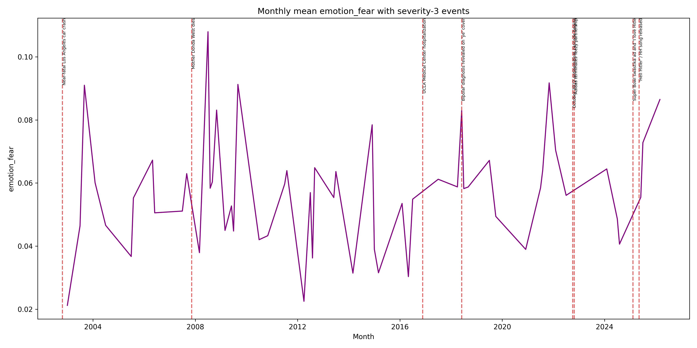
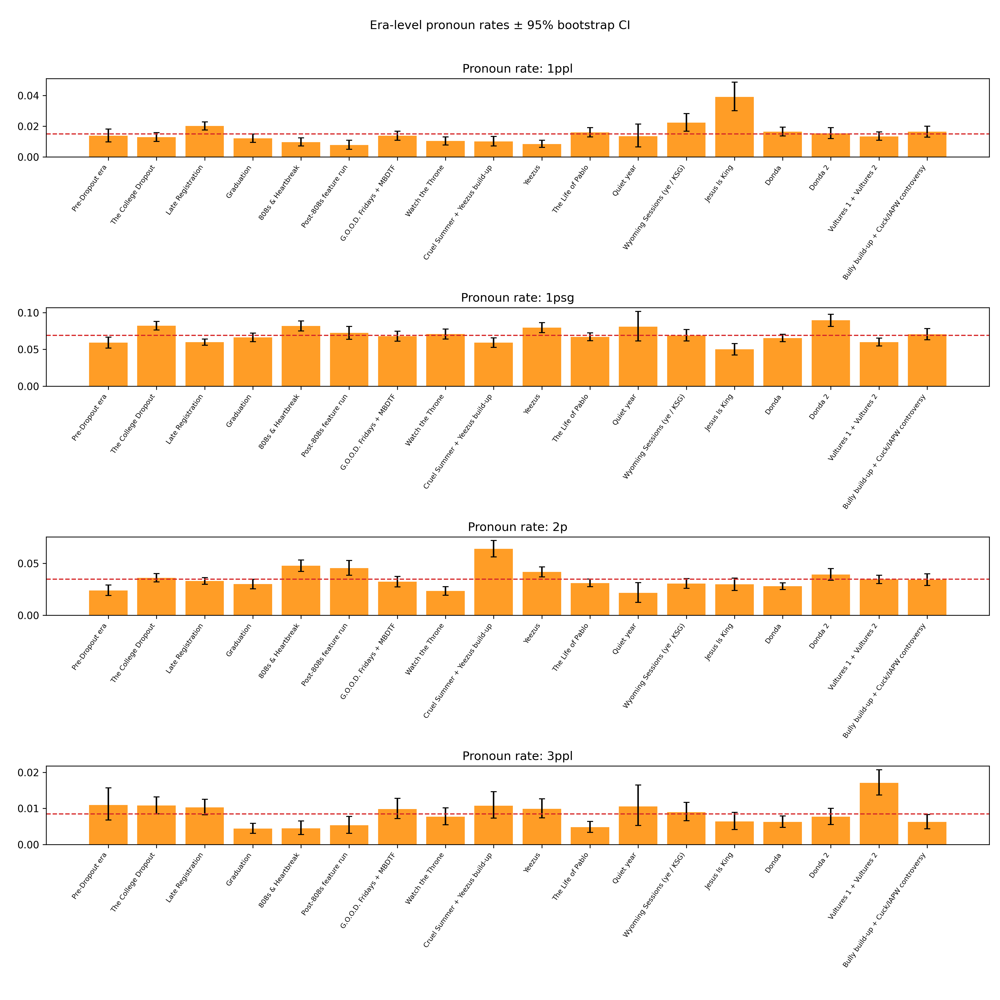
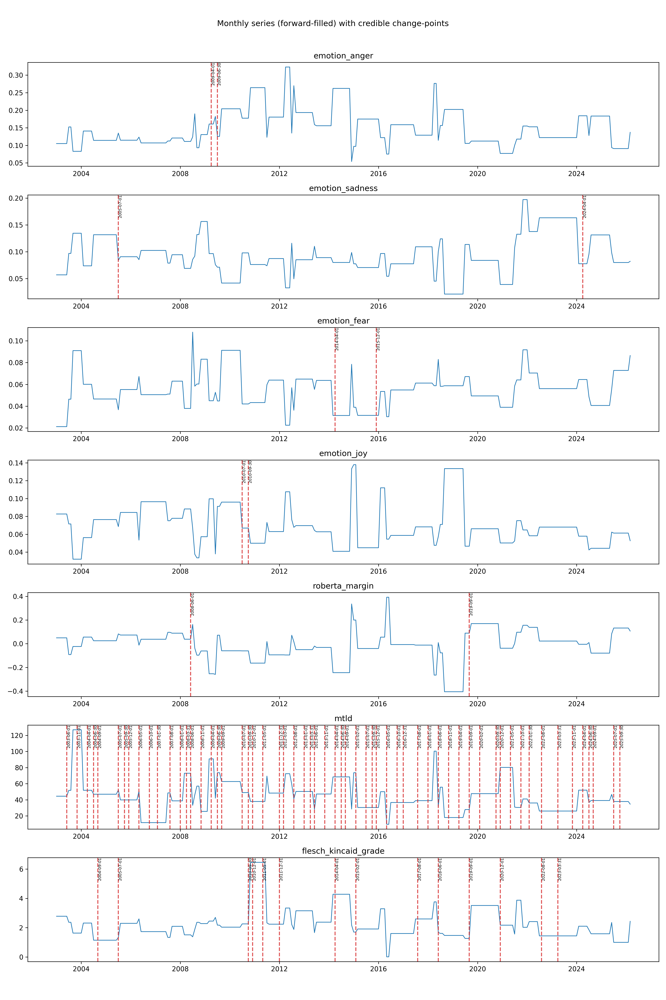

# Phase 3.6 — Era-level rigor + change-point retune

## HEADLINE FINDINGS

- Donda-window fear spike (Phase 3.5 event test): Δ=0.0373, 95% CI [0.0235, 0.0517], permutation p=0.0286, n_lines=756.
- Era-level substantive signatures (exclude baseline & |z|>0.3): **2** pairs (below the Phase 3.6 review threshold of 3; contrasts versus the global mean are sparse at |z|>0.3).
- Highest 1psg deviation era: **Donda 2** (z=0.195, 95% CI [0.0811,0.0978], p=0.0000).
- Lowest 1psg deviation era: **Jesus Is King** (z=-0.186, 95% CI [0.0422, 0.0579], p=0.0000).
- Credible change-points (≥3 settings, ±60d cluster): **84** (see section 4).
- Quote pack v2: **105** curated lines (filtered + deduped).

---

## (1) Donda fear finding

### What was measured
Phase 3.5 severity-3 window test (365d post-event vs baseline) for `emotion_fear` after Mother Donda West dies (2007-11-10).

### Key numbers

- Δ fear (post − baseline): **0.0373** (95% bootstrap CI [0.0235, 0.0517]); permutation **p = 0.0286** (n=756 lines).

### Quotes

- *Amazing* (2008-07-01): I'm the only thing I'm afraid of
- *I Still Love H.E.R.* (2008-07-01): ra-ra-ra-ra-rappers are in danger
- *Put On* (2008-09-02): On, I let my nightmares go
- *Paranoid* (2008-07-01): Don't worry 'bout what we can't control
- *Paranoid* (2008-07-01): You worry 'bout the wrong things

### Interpretation

This is the only curated severity-3 window that survived Phase 3.5 multiple-testing reality; era-level analyses below recover broader structure.

## (2) Era-level emotion profiles

### Chart

### Significant combinations (exclude_baseline & |z|>0.3)

- **Donda 2** × `emotion_sadness`: mean=0.1499, CI [0.1348,0.1655], z=0.319, p=0.0000
- **G.O.O.D. Fridays + MBDTF** × `emotion_anger`: mean=0.2017, CI [0.1839,0.2200], z=0.310, p=0.0000

### Quotes

- (quotes_donda_fear_top5) I'm the only thing I'm afraid of
- (quotes_donda_fear_top5) ra-ra-ra-ra-rappers are in danger
- (quotes_donda_fear_top5) On, I let my nightmares go

### Interpretation

Only **2** pairs cleared both gates (Phase 3.6 targeted ≥3 for a strong era-emotion read); aggregation raises power versus 365-day windows, but line-level emotions mostly hug the global mean.

## (3) Era-level pronoun analysis

- Highest 1psg deviation: **Donda 2** (z=0.195, 95% CI [0.0811, 0.0978], p=0.0000).
- Lowest 1psg deviation: **Jesus Is King** (z=-0.186, 95% CI [0.0422, 0.0579], p=0.0000).

### Quotes

- Sometimes, I scare myself, myself
- Sometimes, I scare, myself, myself
- (I can't live my, I, I can't live my)

### Interpretation
Flat catalog-wide year trends can coexist with strong era heterogeneity in self-focus.

## (4) Change-point credible set

| metric | change_point_date | n_settings_support | support_settings | magnitude | nearest_event | days_to_nearest | nearest_sev3 | days_to_nearest_sev3 |
| --- | --- | --- | --- | --- | --- | --- | --- | --- |
| emotion_anger | 2009-04-01 | 3 | monthly_ffill\|rbf\|10\|monthly_ffill\|rbf\|5\|monthly_ffill\|rbf\|8 | 0.0150572 | South Park 'Fishsticks' airs | 7 | Mother Donda West dies | 508 |
| emotion_anger | 2009-06-30 | 3 | quarterly\|rbf\|3\|quarterly\|rbf\|5\|quarterly\|rbf\|8 | 0.0304077 | Taylor Swift VMA interruption | 75 | Mother Donda West dies | 598 |
| emotion_sadness | 2005-07-01 | 3 | monthly_ffill\|rbf\|3\|monthly_ffill\|rbf\|5\|monthly_ffill\|rbf\|8 | -0.0443884 | Katrina telethon Bush comment | 63 | Mother Donda West dies | 862 |
| emotion_sadness | 2024-04-01 | 3 | monthly_ffill\|rbf\|3\|monthly_ffill\|rbf\|5\|monthly_ffill\|rbf\|8 | 0 | Vultures listening event, North West public debut | 53 | Super Bowl swastika ad and 'I love Hitler' tirade | 314 |
| emotion_fear | 2014-04-01 | 3 | monthly_ffill\|rbf\|3\|monthly_ffill\|rbf\|5\|monthly_ffill\|rbf\|8 | -0.0161021 | Marries Kim Kardashian in Florence | 53 | UCLA Medical Center hospitalization | 965 |
| emotion_fear | 2015-12-01 | 3 | monthly_ffill\|rbf\|3\|monthly_ffill\|rbf\|5\|monthly_ffill\|rbf\|8 | 0 | Son Saint West born | 4 | UCLA Medical Center hospitalization | 356 |
| emotion_joy | 2010-07-01 | 4 | monthly_ffill\|rbf\|10\|monthly_ffill\|rbf\|3\|monthly_ffill\|rbf\|5\|monthly_ffill\|rbf\|8 | -0.0290654 | Taylor Swift VMA interruption | 291 | Mother Donda West dies | 964 |
| emotion_joy | 2010-09-30 | 3 | quarterly\|rbf\|3\|quarterly\|rbf\|5\|quarterly\|rbf\|8 | -0.0347208 | Taylor Swift VMA interruption | 382 | Mother Donda West dies | 1055 |
| roberta_margin | 2008-06-01 | 4 | monthly_ffill\|rbf\|10\|monthly_ffill\|rbf\|3\|monthly_ffill\|rbf\|5\|monthly_ffill\|rbf\|8 | 0.062466 | Mother Donda West dies | 204 | Mother Donda West dies | 204 |
| roberta_margin | 2019-09-01 | 3 | monthly_ffill\|rbf\|3\|monthly_ffill\|rbf\|5\|monthly_ffill\|rbf\|8 | 0.040364 | Son Psalm West born via surrogate | 115 | Bipolar diagnosis revealed on 'ye' cover | 457 |
| mtld | 2003-06-01 | 4 | monthly_ffill\|l2\|10\|monthly_ffill\|l2\|3\|monthly_ffill\|l2\|5\|monthly_ffill\|l2\|8 | 3.64833 | Near-fatal Los Angeles car crash | 221 | Near-fatal Los Angeles car crash | 221 |
| mtld | 2003-11-01 | 4 | monthly_ffill\|l2\|10\|monthly_ffill\|l2\|3\|monthly_ffill\|l2\|5\|monthly_ffill\|l2\|8 | 0 | Near-fatal Los Angeles car crash | 374 | Near-fatal Los Angeles car crash | 374 |
| mtld | 2004-04-01 | 4 | monthly_ffill\|l2\|10\|monthly_ffill\|l2\|3\|monthly_ffill\|l2\|5\|monthly_ffill\|l2\|8 | 0 | Katrina telethon Bush comment | 519 | Near-fatal Los Angeles car crash | 526 |
| mtld | 2004-06-30 | 4 | quarterly\|l2\|10\|quarterly\|l2\|3\|quarterly\|l2\|5\|quarterly\|l2\|8 | -52.4899 | Katrina telethon Bush comment | 429 | Near-fatal Los Angeles car crash | 616 |
| mtld | 2004-09-01 | 4 | monthly_ffill\|l2\|10\|monthly_ffill\|l2\|3\|monthly_ffill\|l2\|5\|monthly_ffill\|l2\|8 | 0 | Katrina telethon Bush comment | 366 | Near-fatal Los Angeles car crash | 679 |
| mtld | 2005-07-01 | 4 | monthly_ffill\|l2\|10\|monthly_ffill\|l2\|3\|monthly_ffill\|l2\|5\|monthly_ffill\|l2\|8 | -0.923019 | Katrina telethon Bush comment | 63 | Mother Donda West dies | 862 |
| mtld | 2005-09-30 | 4 | quarterly\|l2\|10\|quarterly\|l2\|3\|quarterly\|l2\|5\|quarterly\|l2\|8 | -5.02231 | Katrina telethon Bush comment | 28 | Mother Donda West dies | 771 |
| mtld | 2005-12-01 | 4 | monthly_ffill\|l2\|10\|monthly_ffill\|l2\|3\|monthly_ffill\|l2\|5\|monthly_ffill\|l2\|8 | 0 | Katrina telethon Bush comment | 90 | Mother Donda West dies | 709 |
| mtld | 2006-05-01 | 7 | monthly_ffill\|l2\|10\|monthly_ffill\|l2\|3\|monthly_ffill\|l2\|5\|monthly_ffill\|l2\|8\|monthly_ffill\|rbf\|3\|monthly_ffill\|rbf\|5\|monthly_ffill\|rbf\|8 | -8.72214 | Katrina telethon Bush comment | 241 | Mother Donda West dies | 558 |
| mtld | 2006-10-01 | 4 | monthly_ffill\|l2\|10\|monthly_ffill\|l2\|3\|monthly_ffill\|l2\|5\|monthly_ffill\|l2\|8 | 0 | Katrina telethon Bush comment | 394 | Mother Donda West dies | 405 |
| mtld | 2007-01-30 | 8 | monthly_ffill\|l2\|10\|monthly_ffill\|l2\|3\|monthly_ffill\|l2\|5\|monthly_ffill\|l2\|8\|quarterly\|l2\|10\|quarterly\|l2\|3\|quarterly\|l2\|5\|quarterly\|l2\|8 | -5.5881 | Mother Donda West dies | 254 | Mother Donda West dies | 254 |
| mtld | 2007-08-01 | 7 | monthly_ffill\|l2\|10\|monthly_ffill\|l2\|3\|monthly_ffill\|l2\|5\|monthly_ffill\|l2\|8\|monthly_ffill\|rbf\|3\|monthly_ffill\|rbf\|5\|monthly_ffill\|rbf\|8 | 13.5042 | Mother Donda West dies | 101 | Mother Donda West dies | 101 |
| mtld | 2008-01-01 | 4 | monthly_ffill\|l2\|10\|monthly_ffill\|l2\|3\|monthly_ffill\|l2\|5\|monthly_ffill\|l2\|8 | 0 | Mother Donda West dies | 52 | Mother Donda West dies | 52 |
| mtld | 2008-03-31 | 4 | quarterly\|l2\|10\|quarterly\|l2\|3\|quarterly\|l2\|5\|quarterly\|l2\|8 | 19.5465 | Mother Donda West dies | 142 | Mother Donda West dies | 142 |
| mtld | 2008-06-01 | 4 | monthly_ffill\|l2\|10\|monthly_ffill\|l2\|3\|monthly_ffill\|l2\|5\|monthly_ffill\|l2\|8 | -19.8962 | Mother Donda West dies | 204 | Mother Donda West dies | 204 |
| mtld | 2008-11-01 | 4 | monthly_ffill\|l2\|10\|monthly_ffill\|l2\|3\|monthly_ffill\|l2\|5\|monthly_ffill\|l2\|8 | -31.3707 | South Park 'Fishsticks' airs | 158 | Mother Donda West dies | 357 |
| mtld | 2009-04-01 | 4 | monthly_ffill\|l2\|10\|monthly_ffill\|l2\|3\|monthly_ffill\|l2\|5\|monthly_ffill\|l2\|8 | 32.5879 | South Park 'Fishsticks' airs | 7 | Mother Donda West dies | 508 |
| mtld | 2009-06-30 | 4 | quarterly\|l2\|10\|quarterly\|l2\|3\|quarterly\|l2\|5\|quarterly\|l2\|8 | 30.5594 | Taylor Swift VMA interruption | 75 | Mother Donda West dies | 598 |
| mtld | 2009-09-01 | 6 | monthly_ffill\|l2\|10\|monthly_ffill\|l2\|3\|monthly_ffill\|l2\|5\|monthly_ffill\|l2\|8\|monthly_ffill\|rbf\|3\|monthly_ffill\|rbf\|5 | -10.9617 | Taylor Swift VMA interruption | 12 | Mother Donda West dies | 661 |
| mtld | 2010-07-01 | 6 | monthly_ffill\|l2\|10\|monthly_ffill\|l2\|3\|monthly_ffill\|l2\|5\|monthly_ffill\|l2\|8\|monthly_ffill\|rbf\|3\|monthly_ffill\|rbf\|5 | -13.7183 | Taylor Swift VMA interruption | 291 | Mother Donda West dies | 964 |
| mtld | 2010-09-30 | 4 | quarterly\|l2\|10\|quarterly\|l2\|3\|quarterly\|l2\|5\|quarterly\|l2\|8 | -17.4006 | Taylor Swift VMA interruption | 382 | Mother Donda West dies | 1055 |
| mtld | 2010-12-01 | 4 | monthly_ffill\|l2\|10\|monthly_ffill\|l2\|3\|monthly_ffill\|l2\|5\|monthly_ffill\|l2\|8 | -5.52333 | Taylor Swift VMA interruption | 444 | Mother Donda West dies | 1117 |
| mtld | 2011-05-01 | 4 | monthly_ffill\|l2\|10\|monthly_ffill\|l2\|3\|monthly_ffill\|l2\|5\|monthly_ffill\|l2\|8 | 0 | Begins dating Kim Kardashian | 336 | Mother Donda West dies | 1268 |
| mtld | 2011-12-31 | 4 | quarterly\|l2\|10\|quarterly\|l2\|3\|quarterly\|l2\|5\|quarterly\|l2\|8 | 1.69113 | Begins dating Kim Kardashian | 92 | Mother Donda West dies | 1512 |
| mtld | 2012-03-01 | 4 | monthly_ffill\|l2\|10\|monthly_ffill\|l2\|3\|monthly_ffill\|l2\|5\|monthly_ffill\|l2\|8 | 12.0322 | Begins dating Kim Kardashian | 31 | Mother Donda West dies | 1573 |
| mtld | 2012-08-01 | 4 | monthly_ffill\|l2\|10\|monthly_ffill\|l2\|3\|monthly_ffill\|l2\|5\|monthly_ffill\|l2\|8 | -20.0533 | Begins dating Kim Kardashian | 122 | UCLA Medical Center hospitalization | 1573 |
| mtld | 2013-01-01 | 3 | monthly_ffill\|l2\|3\|monthly_ffill\|l2\|5\|monthly_ffill\|l2\|8 | 0 | Daughter North West born | 165 | UCLA Medical Center hospitalization | 1420 |
| mtld | 2013-03-31 | 4 | quarterly\|l2\|10\|quarterly\|l2\|3\|quarterly\|l2\|5\|quarterly\|l2\|8 | -3.66395 | Daughter North West born | 76 | UCLA Medical Center hospitalization | 1331 |
| mtld | 2013-06-01 | 4 | monthly_ffill\|l2\|10\|monthly_ffill\|l2\|3\|monthly_ffill\|l2\|5\|monthly_ffill\|l2\|8 | -12.6217 | Daughter North West born | 14 | UCLA Medical Center hospitalization | 1269 |
| mtld | 2013-11-01 | 4 | monthly_ffill\|l2\|10\|monthly_ffill\|l2\|3\|monthly_ffill\|l2\|5\|monthly_ffill\|l2\|8 | 0 | Engagement to Kim Kardashian | 11 | UCLA Medical Center hospitalization | 1116 |

_Showing first 40 of 84 rows._

_Full table: `data/phase_3_6_change_points_credible.csv` (84 rows)._

### Interpretation
Parameter sweep exposes instability at pen=10-only defaults; consensus CPs are rarer.

## (5) Fear deep dive

| month | mean_emotion_fear | tracks_released | days_to_nearest_sev3 | hidden_fear_inflection | hidden_inflection_name |
| --- | --- | --- | --- | --- | --- |
| 2008-07-01 | 0.107976 | Amazing; Digital Girl; Everybody; Everyone Nose (Remix); Finer Things; Go Hard; I Still Love H.E.R.; It's Over; Paranoid; Punch Drunk Love; See You in My Nightmares; Welcome to Heartbreak | 234 | True | Hidden fear spike (2008-07-01, Δdays≥181 from nearest severity-3) |
| 2021-11-01 | 0.0917575 | Never Abandon Your Family; Up From the Ashes | 336 | True | Hidden fear spike (2021-11-01, Δdays≥181 from nearest severity-3) |
| 2009-09-01 | 0.0912702 | Forever; Make Her Say | 661 | True | Hidden fear spike (2009-09-01, Δdays≥181 from nearest severity-3) |
| 2003-09-01 | 0.0910111 | Through the Wire | 313 | True | Hidden fear spike (2003-09-01, Δdays≥181 from nearest severity-3) |
| 2026-03-01 | 0.0864783 | Circles; Damn; Highs and Lows; King; Preacher Man; This a Must | 297 | True | Hidden fear spike (2026-03-01, Δdays≥181 from nearest severity-3) |

### Interpretation
Top fear months outside curated-event proximity flag candidate hidden fear inflections.

## (6) Appendix — Phase 3.5 non-significant event windows

31 emotion-window tests were not significant at α=0.05 (retained for transparency).
