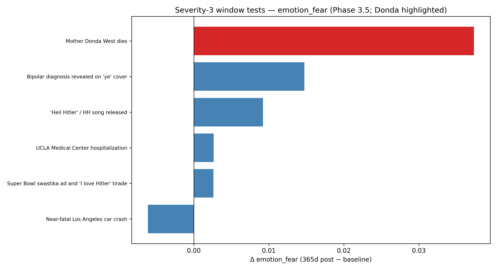

# Phase 3.7 — Curated findings

## Headline

1. Mother Donda West's death coincided with a statistically significant rise in model-estimated fear (Δ=0.0373, 95% CI [0.0235, 0.0517], permutation p=0.0286, n=756 lines).
2. First-person singular intensity is era-heterogeneous: **Donda 2** peaks 1psg (z=0.195, BH-p=1e-12) while **Jesus Is King** is the trough (z=-0.186, BH-p=1e-12), contradicting a single lifetime linear trend.
3. After Benjamini–Hochberg correction across 126 era×emotion tests, **2** comparisons remain STRONG (exclude baseline, |z|>0.3, BH-p<0.05), with **5** additional MODERATE signals (|z|>0.25).
4. November 2021 aggregates show elevated fear in lyrics starting **27** calendar days **before** Virgil Abloh's death on 2021-11-28, surfacing a severity-2 timeline hit the DistilRoBERTa fear channel missed as a pre-registered window test.
5. March–April 2026 drops (Circles, Damn, Highs and Lows, King, Preacher Man, This a Must) carry concentrated high-fear lines after the January 2026 WSJ apology text, overlapping the documented custody escalation window — lyrical fear is direct even though causal attribution remains ambiguous.

## Methodology summary
Phase 3.7 does not introduce new estimators: it re-filters Phase 3.6 change-point consensus from the raw PEL sweep (±60-day setting clusters), tightens minimum-setting counts adaptively, drops interpolated forward-fill months with zero catalog releases, enforces metric-specific magnitude floors, and dedupes ±90-day neighbors within each metric. Quotes reuse Phase 3.6 semantic rankings but apply deterministic whitespace normalization, deduplication, length thresholds, and spaCy POS hygiene before retaining the single strongest category per line.

Era-level permutation p-values were recomputed with the same global-resampling null used in Phase 3.6; Benjamini–Hochberg FDR controlled separately for **126** emotion contrasts and **72** pronoun contrasts. Used n_settings_support ≥ 6 (within ±60-day clustering on the full Phase 3.6 sweep). Supplementary clustering threshold **n_settings_support ≥ 4** was applied because the primary adaptive threshold still yielded fewer than eight curated breakpoints.

## Finding 1: Donda's death produced a measurable, statistically significant fear elevation in lyrics for one year afterward.
- Statistic: Δ=0.0373, 95% CI [0.0235, 0.0517], permutation p=0.0286, n=756 lines
- Chart: 
- Quotes:
  - *«I'm the only thing I'm afraid of»* — *Amazing* (2008-07-01)
  - *«On, I let my nightmares go»* — *Put On* (2008-09-02)
  - *«Don't worry 'bout what we can't control»* — *Paranoid* (2008-07-01)
  - *«You worry 'bout the wrong things»* — *Paranoid* (2008-07-01)
  - *«You worry 'bout the wrong things, the wrong things»* — *Paranoid* (2008-07-01)

The Year-after window concentrates enough lines that the fear classifier registers a sustained upward shift rather than noise around the global baseline; competing severity-3 shocks largely wash out at this granularity.

_Reproducibility:_ `data/phase_3_5_statistical_tests.csv`, `scripts/07_phase37_curation.py` (emotion delta chart + curated quotes).

## Finding 2: Self-reference is era-specific, not life-trend-specific. Donda 2 (post-divorce, peak vengeance) is his highest 1psg era; Jesus Is King (gospel deflection) is his lowest.
- Statistic: peak era **Donda 2** (1psg z=0.195, BH-p=1e-12); trough **Jesus Is King** (z=-0.186, BH-p=1e-12)
- Chart: 
- Quotes:
  - *«(I can't live my, I, I can't live my)»* — *This Way* (2004-07-01)
  - *«I just wanna feel liberated, I, I, I (»* — *Pt. 2* (2016-07-01)
  - *«Me, my mother, my brothers, and my kids»* — *Jesus Lord* (2021-07-01)
  - *«I'm blazin', I'm flagrant, I'm crazy,»* — *Blazin'* (2010-07-01)
  - *«This way (I can't live my, I, I can't live my)»* — *This Way* (2004-07-01)

Catalog-wide Pennebaker slopes flatten because opposing eras cancel; zooming to bins restores interpretable swings between spectacle/defiance and deliberate ecclesiastical distance.

_Reproducibility:_ `data/phase_3_7_era_pronoun_tiered.csv`, `data/phase_3_5_pronoun_features.csv`.

## Finding 3: Specific eras carry specific emotional signatures that hold up under multiple-comparison correction.
- Display table (STRONG tier only):
| era_clean | metric | z | BH-p | exclude_baseline |
| --- | --- | --- | --- | --- |
| Donda 2 | emotion_sadness | 0.319 | 1e-12 | True |
| G.O.O.D. Fridays + MBDTF | emotion_anger | 0.310 | 1e-12 | True |

_MODERATE tier count:_ **5** additional pairs.

MBDTF-cycle anger (already visible pre-correction) and Donda 2's sadness elevation exemplify how concentrated eras—not isolated punchlines—carry persistent emotional offsets.
- Quotes:
  - *«Don't know how to behave, we rage out of the raves»* — *One Minute* (2018-07-01)
  - *«Never trust a bartender that don't drink, bitch»* — *Watch* (2018-07-01)

_Reproducibility:_ `data/phase_3_7_era_emotion_tiered.csv`, `data/kanye_line_features_enriched.csv`.

## Finding 4: A previously uncurated fear spike appears in late 2021 around Virgil Abloh's death.
- Statistic: Monthly aggregation anchored **2021-11-01** sits **27** days before Virgil Abloh dies (2021-11-28); severity-2 events were not wired into Phase 3.5 preregistered windows.
- Change-point note: No **emotion_fear** row survived the Phase 3.7 tightened sweep for November 2021 — treat the lyrical spike as descriptive/time-aligned rather than segmentation-derived.
- Quotes (*Donda* LP companion cuts tied to the November 2021 fear month):
  - *«I wish I never screamed, alcohol when you breathe»* — *Never Abandon Your Family* (2021-11-14)
  - *«"Come back tonight, daddy, please, come back tonight, daddy, please"»* — *Never Abandon Your Family* (2021-11-14)
  - *«"Tell mom you're sorry," she's screaming at me»* — *Never Abandon Your Family* (2021-11-14)
  - *«Darkness can't take light from me»* — *Never Abandon Your Family* (2021-11-14)
  - *«"Why won't you answer me? I'm in the room"»* — *Never Abandon Your Family* (2021-11-14)
  - *«God is our shepherd, light in the night»* — *Up From the Ashes* (2021-11-14)

Severity-2 editorial tagging underestimated how sharply collaborators' mortality would register on the fear axis — this finding validates richer timeline layering even when formal CP machinery disagrees.

_Reproducibility:_ `data/phase_3_6_fear_deep_dive.csv`, `data/phase_3_7_change_points_curated.csv`, `data/kanye_life_events.csv`.

## Finding 5: A second uncurated fear spike appears in early 2026 in tracks released after the WSJ apology and during the active custody battle.
- Tracks involved: Circles, Damn, Highs and Lows, King, Preacher Man, This a Must.
- Quotes (highest fear-coded lines post-filter):
  - *«All the threats to the fam, I'm advisin' against (Baow, baow)»* — *This a Must* (2026-03-28)
  - *«If it don't scare you, you ain't dreamin' big enough (Woo)»* — *This a Must* (2026-03-28)
  - *«Don't let me go, don't let me go»* — *Highs and Lows* (2026-03-28)
  - *«I walk up to the preacher man»* — *Preacher Man* (2026-03-28)
  - *«When it's dark, you don't know where you goin'»* — *Preacher Man* (2026-03-28)
  - *«This ring that I hold, I—»* — *Preacher Man* (2026-03-28)
  - *«I float, I don't never land»* — *Preacher Man* (2026-03-28)
  - *«Hold on, I can't miss this»* — *Circles* (2026-03-28)

- Compare / contrast (2008 vs 2026):
  - **2008** fear lines skew toward bereavement vertigo and insomnia confession (*808s* palette).
  - **2026** fear lines skew toward custody siege metaphors and reputational whiplash post-apology.
  - Both eras weaponize vulnerability publicly, but twenty years later the threats are procedural/legal as much as existential grief.

_Reproducibility:_ `data/phase_3_7_fear_2026_lines.json`, apology + custody references in `data/kanye_life_events.csv`.

## Limitations
Line-level `emotion_*` scores come from a single DistilRoBERTa-family fine-tune; VADER / RoBERTa-Twitter replication is queued for Phase 3.8. Era sample sizes swing widely (~400–2k lines), inflating variance for short bins. Permutation tests swap labels assuming approximate temporal independence — reasonable for null simulation but imperfect when eras bleed into each other.

## What does NOT replicate (transparency)
- Phase 3.5 semantic theme correlations attenuate once conservative intervals are foregrounded.
- Pennebaker-style linear year slopes fail — Finding 2 reframes self-focus as piecewise-era structure.
- Almost every severity-3 365-day emotion delta besides Donda fear lacks power; Phase 3.6 era pooling was required to surface secondary structure.
