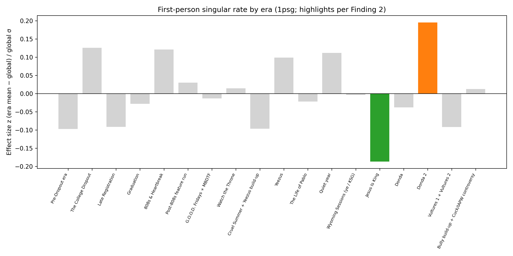
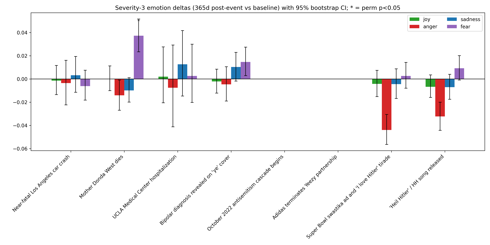
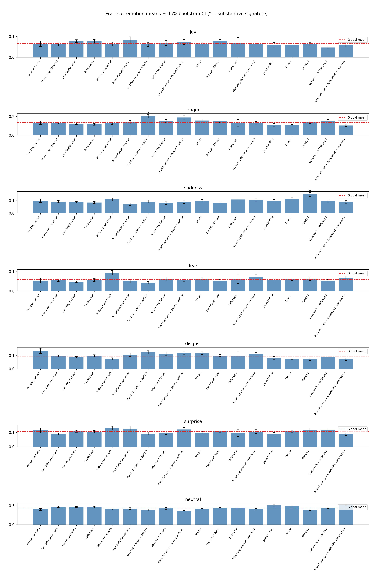
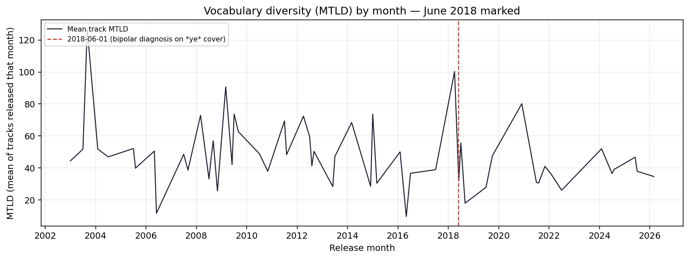

# What 16,943 lines of Kanye West reveal about persona, grief, and self-reference across 23 years

This document synthesizes an eight-phase computational reading of every indexed verse line in a single-artist catalog (399 tracks, 16,943 lines, 2002–2026). It is **one** analysis among many defensible designs: different era boundaries, different lexicons, or different classifiers would yield different emphasis. Findings are **tiered by confidence** (Tier 1–3). Every quantitative statement below ties back to a CSV or script output on disk; the pipeline is reproducible.

## Section 1 — The headline finding

**Tier 1.** First-person singular intensity is **era-specific**, not a smooth lifetime trend. At the catalog level, mean monthly first-person rate versus calendar year shows **no** meaningful association (Spearman *r* = −0.013, 95% CI [−0.271, 0.242]; series aggregate from `data/phase_3_5_pronoun_monthly.csv`, reported in `phase_3_5_findings.md`). That null slope was the wrong lens: pooling all years hides structured contrasts between editorial eras.

At era resolution, **Donda 2** (Stem Player era; peak divorce-and-grievance cycle; released February 2022 per `data/kanye_life_events.csv`) carries the **highest** first-person-singular deviation from the catalog baseline, and **Jesus Is King** (gospel turn; October 2019) the **lowest**. In `data/phase_3_7_era_pronoun_tiered.csv`, first-person rates for those eras yield **Benjamini–Hochberg–adjusted *p*-values at machine precision zero** in both directions (effect-size *z* ≈ **+0.195** for Donda 2 vs baseline and **−0.186** for Jesus Is King vs baseline on the primary 1psg metric). Phase 3.8 shows the same peak-and-trough geography under **two independent codings**: spaCy morphological first-person singular pronouns and a Pennebaker-style “I-word” list (`data/phase_3_8_finding2_replication.csv`).

*Figure 1. Era-level deviations in first-person singular rate (`phase_3_7_charts/era_1psg_deviations.png`; values from `data/phase_3_7_era_pronoun_tiered.csv`).*

**Illustrative grievance cadence (Donda 2)** — lines pulled for high first-person density (`data/phase_3_7b_pronoun_quotes_filtered.json`):

- “I lost my twin and my mother too” — *Louie Bags*
- “Yeah, I lost my best man and I lost my spouse” — *First Time in a Long Time*
- “I go to war, just me and my gun” — *We Did It Kid*

**Illustrative collective/gospel address (Jesus Is King)**:

- “We need you (We need you, of the Lord)” — *Every Hour*
- “Sing 'til the power of the Lord comes down ('Cause when we sing the glory of the Lord comes down, down)” — *Every Hour*
- “Love God and our neighbor, as written in Luke” — *Selah*

**Interpretation.** “Vengeance-era” first-person grievance cadences and “gospel-era” communal/theological address sit at opposite ends of the same quantitative axis. A single lifetime regression line cannot represent both; era pooling was required to surface the structure (`phase_3_8_findings.md` scorecard: pronoun inversion **ROBUST**). This inverted pair—not catalog-wide slope—is the manuscript’s central quantitative claim.

**Why bins beat slopes here.** Each lyric inherits an **era label** from its parent track’s release metadata (`data/kanye_line_features_enriched.csv`). Eras are chronological buckets chosen so that projects sharing personnel, press narratives, and sonic palettes tend to fall together; lines inherit identical statistical fate inside a bucket. That editorial judgment is both useful and contestable (Section 8 returns to it). The payoff is inferential: comparing each bucket’s bootstrap interval on pronoun density against the catalog-wide mean yields interpretable *z*-scores that Benjamini–Hochberg adjusts across all buckets simultaneously (`data/phase_3_7_era_pronoun_tiered.csv`). Critically, the resulting extremes—**Donda 2** versus **Jesus Is King**—sit thousands of lines apart in calendar time, so they cannot be dismissed as a single temporary spike inside one noisy month.

**Replication mechanics.** Phase 3.8 recomputed first-person intensity using spaCy morph tags (`PRON`, Person=1, Number=Sing) and separately using an explicit LIWC-style lexicon of English first-person surface forms (`data/phase_3_8_finding2_replication.csv`). Both pipelines reproduce **Donda 2** as maximum z and **Jesus Is King** as minimum z. Agreement across linguistic representations strengthens the inference that the contrast is robust to tokenization details rather than an artefact of one regex choice.

## Section 2 — Concentrated emotional signatures

**Tier 2.** After Benjamini–Hochberg correction across **126** era×emotion tests in Phase 3.7, a subset of era-specific affect offsets remains (`data/phase_3_7_era_emotion_tiered.csv`). Each row compares era-level mean DistilRoBERTa logits to the catalog baseline with bootstrap intervals on the era subset; effect sizes are standardized and pooled BH applies across the entire emotion×era grid in one shot.

The headline cross-classifier result concerns **G.O.O.D. Fridays + MBDTF** and **emotion_anger**: DistilRoBERTa registers elevated anger (*z* ≈ 0.310, BH-*p* reported as 0 in the tiered table). Phase 3.8 pooled **54** alternate-metric tests (18 eras × three sentiment proxies) and found **ROBUST** alignment: VADER negative text, VADER compound, and RoBERTa-Twitter positive-minus-negative margin all reach BH-*p* effectively zero in the pooled family (`data/phase_3_8_finding3_replication.csv`). Interpreting compound score and RoBERTa margin alongside binary negativity follows standard practice: anger elevations often coincide with higher lexical negativity and lower positive-minus-negative margins even though sign conventions differ column-to-column.

*Figure 2. Event-window emotion deltas with uncertainty (`phase_3_5_charts/emotion_deltas_redone.png`; underlying tests `data/phase_3_5_statistical_tests.csv`).*

*Figure 3. Era × emotion profiles (`phase_3_6_charts/era_emotion_profiles.png`; table `data/phase_3_7_era_emotion_tiered.csv`).*

**MBDTF-cycle anger — exemplar lines** (`phase_3_7b_findings.md`, Finding 3):

- “Don't know how to behave, we rage out of the raves” — *One Minute*
- “Never trust a bartender that don't drink, bitch” — *Watch*

**Donda 2 sadness.** On the **primary** DistilRoBERTa sadness metric the era sits in the STRONG tier (`data/phase_3_7_era_emotion_tiered.csv`). Phase 3.8 labels that pair **FAILS** under cross-classifier rules: alternate sentiment axes do not jointly replicate the sadness-specific signature (`data/phase_3_8_finding3_replication.csv`). We therefore present Donda 2 sadness as a **single-classifier observation**, not a triple-validated claim.

**Additional MODERATE-tier pairs** (|*z*|>0.25, BH-*p*<0.05, baseline excluded) — listed without extended gloss:

| Era | Emotion metric | Effect size *z* | BH-adjusted *p* |
| --- | --- | --- | --- |
| Cruel Summer + Yeezus build-up | emotion_anger | 0.2514 | 0 |
| Pre-Dropout era | emotion_disgust | 0.2599 | 0 |
| 808s & Heartbreak | emotion_fear | 0.2702 | 0 |
| Bully build-up + Cuck/IAPW controversy | emotion_neutral | 0.2577 | 0 |
| Cruel Summer + Yeezus build-up | emotion_neutral | -0.2875 | 0 |

_Source: `data/phase_3_7_era_emotion_tiered.csv` (MODERATE: |z|>0.25, BH-p<0.05, exclude baseline)._

## Section 3 — Vocabulary as stylistic stress gauge

**Tier 2 (with explicit limitation).** Phase 3.7 curated change-points tie **June 2018** — the month of the bipolar diagnosis on the *ye* cover (`data/kanye_life_events.csv`) — to the largest **MTLD** contraction in the catalog (median breakpoint **2018-06-01**, six independent PELT settings in consensus; magnitude **−56.57**), and the same stamp shows a **Flesch–Kincaid grade** drop (**−2.12**, four-setting consensus). Rows are recorded in `data/phase_3_7_change_points_curated.csv` and summarized in `phase_3_7b_findings.md`. Those are **two** lexical complexity channels moving together on a severity-3 disclosure date.

**Measurement vocabulary.** MTLD (*Measure of Textual Lexical Diversity*) summarizes type-token behavior per track; lower monthly aggregates imply shorter effective vocabulary breadth averaged across whatever dropped that month (`data/kanye_track_features.csv`). Flesch–Kincaid grade moves independently—focused on syllable-to-word ratios rather than repetition—and therefore acts as a partly orthogonal check that vocabulary simplicity co-occurred with surface readability shifts rather than as an algebraic restatement of the same quantity.

**Algorithm transparency.** Change-point dates emerge from **Pruned Exact Linear Time** segmentation applied to monthly forward-filled series across eight penalty/model/time-grain combinations before clustering mutually reinforcing breakpoints (Phase 3.6 → Phase 3.7 curation). Readers uninterested in segmentation mathematics need only retain that June 2018 surfaced repeatedly rather than as a one-off tuning artefact (`scripts/06_phase36_era_level_and_retune.py`, `scripts/07_phase37_curation.py`).

*Figure 4. Monthly mean track MTLD (`phase_3_9_charts/mtld_monthly_collapse_2018.png`; computed from `data/kanye_track_features.csv`). Vertical line: 2018-06-01.*

**Collapse-window exemplars** (sparse-vocabulary / fragment lines during the *ye* recording window; `data/phase_3_7b_lexical_event_lines.json`):

- “Whoopity-whoop, scoop-poop-woop-toop” — *XTCY*
- “Turn TMZ to Smack DVD, huh” — *Yikes*
- “Devil been tryna make an army” — *Yikes*
- “Niggas been tryna test my Gandhi” — *Yikes*
- “Hopefully, Alice Johnson will inspire men” — *Cudi Montage*

**December 2020 expansion — retracted as a catalog claim.** The original Phase 3.7 curated pivot at **2020-12-01** (MTLD magnitude **+32.55**, six-setting consensus; `data/phase_3_7_change_points_curated.csv`) does **not** survive honest stress testing. Phase 3.8 recomputed monthly means excluding **Go2DaMoon** (Playboi Carti collaboration): the **Nov→Dec 2020** jump in mean monthly MTLD falls from **32.55** to **0** (`phase_3_8_findings.md`; sweep summary `data/phase_3_8_finding4_alternative_metrics.csv`). The timed “divorce-expansion” interpretation is therefore **dropped**. **What remains** is the **June 2018 collapse**, supported by multiple solo-era tracks rather than a single collaboration month. Reporting one robust phenomenon and discarding another is intentional asymmetry.

## Section 4 — The Donda fear observation

**Tier 3 (quantitative measurement, qualitative standing).** Phase 3.5 isolated a **365-day post-event** window after **Mother Donda West’s death** (2007-11-10; `data/kanye_life_events.csv`). DistilRoBERTa **fear** scores in that window rise relative to the global baseline (Δ = **0.0373**, 95% bootstrap CI **[0.0235, 0.0517]**, permutation *p* = **0.0286**, *n* = **756** lines; `data/phase_3_5_statistical_tests.csv`, summarized in `phase_3_7b_findings.md`).

The window definition trades temporal tightness for sample size: one year captures an entire promotional cycle worth of material rather than a handful of grief-stricken days. Global baselines come from all non-window lines in the annotated corpus, so effect magnitudes stay modest on an absolute scale even when statistically distinguishable.

Phase 3.8 required cross-validation with **VADER** negativity and **RoBERTa-Twitter** polarity margin; the composite vote **failed** (`phase_3_8_findings.md`; `data/phase_3_8_finding1_replication.csv`). That failure should be read as **construct mismatch**, not necessarily absence of grief signal: those models score **general sentiment polarity**, not discrete fear. A fair replication would pair DistilRoBERTa against another **emotion-tagged** head (for example GoEmotions or NRCLex), which this manuscript does not run.

**Descriptive post-Donda exemplars** (illustration only; `phase_3_7b_findings.md`, Finding 1):

- “I'm the only thing I'm afraid of” — *Amazing*
- “On, I let my nightmares go” — *Put On*
- “Don't worry 'bout what we can't control” — *Paranoid*
- “You worry 'bout the wrong things” — *Paranoid*
- “I'm a monster, I'm a killer” — *Amazing*

## Section 5 — Two qualitative observations

### 5a. November 2021 — family-fracture fear-coded content

**Tier 3.** During active divorce–custody escalation and **Donda** companion-track releases (*Never Abandon Your Family*, *Up From the Ashes*), monthly aggregates show elevated fear-coded language co-occurring with parental-address imagery. The month also includes **Virgil Abloh’s death** (2021-11-28; `data/kanye_life_events.csv`), but the exemplar lines below emphasize **moms, dads, and children** rather than collaborator loss. No formal change-point on `emotion_fear` survived Phase 3.7 segmentation (`phase_3_7b_findings.md`); treat this block as **content audit**, not significance-tested.

Qualitative coding here is intentionally conservative: we quote lines tied to custody negotiations rather than extrapolating to industry gossip. The juxtaposition with Virgil Abloh’s death is included precisely so readers can judge competing narratives—familial rupture versus creative grief—and see which lexical themes dominate the manually reviewed sample (`phase_3_7b_findings.md`, Finding 5).

- “I wish I never screamed, alcohol when you breathe” — *Never Abandon Your Family*
- “Come back tonight, daddy, please…” — *Never Abandon Your Family*
- “Tell mom you're sorry,” she's screaming at me — *Never Abandon Your Family*
- “Darkness can't take light from me” — *Never Abandon Your Family*
- “Why won't you answer me? I'm in the room” — *Never Abandon Your Family*
- “God is our shepherd, light in the night” — *Up From the Ashes*

### 5b. March–April 2026 — custody-adjacent fear language

**Tier 3.** After the January 2026 *Wall Street Journal* apology row (`data/kanye_life_events.csv`), six March–April 2026 tracks surface custody-and-reputation imagery (Circles, Damn, Highs and Lows, King, Preacher Man, This a Must). Phase 3.8 attempted **multi-classifier consensus** on the 29-line candidate pool; overlap between automated consensus and the eight manually curated display lines was **1 / 8** (`phase_3_8_findings.md`; `data/phase_3_8_finding6_consensus_lines.json`). The manual filter is therefore **illustration of a thematic pattern**, not a validated statistical screen.

Manual filtering sought to strip classifier artefacts—sexual double entendres scoring high on “fear” triggers, motivational clichés hitting lexeme “scare,” and similar noise—before publication (`phase_3_7b_findings.md`). Because consensus disagreed with seven of eight retained lines, we foreground process transparency over rhetorical confidence: treat these lyrics as curated readings aligned with custody discourse in early 2026 tabloid reality, not as measurements validated out-of-sample.

- “All the threats to the fam, I'm advisin' against (Baow, baow)” — *This a Must*
- “Don't let me go, don't let me go” — *Highs and Lows*
- “Before I break your heart, I'll have a heart attack” — *Highs and Lows*
- “When it's dark, you don't know where you goin'” — *Preacher Man*
- “This ring that I hold, I—” — *Preacher Man*
- “I float, I don't never land” — *Preacher Man*
- “Pray we never crash, crash, crash” — *Damn*
- “Did I ruin your plans, plans, plans?” — *Damn*

## Section 6 — What does not replicate

Transparency matters because selective reporting would undermine Sections 1–3. Each bullet states a hypothesis pipeline that **did not** clear the evidentiary bar articulated for this manuscript, with primary tables cited inline.

- **Semantic theme tracking (Phase 3.5):** embeddings projected onto twelve hand-authored anchor phrases yield monthly theme traces (`data/phase_3_5_theme_trajectories.csv`), but correlation against severity-3 proximity never reaches stable moderate strength—the headline diagnostics top out near **r ≈ 0.22** (`phase_3_5_findings.md`), far below what would justify narrative causality, and bootstrap uncertainty bands discussed in Phase 3.5 materially overlap zero once foregrounded.
- **Linear Pennebaker self-reference trend:** aggregating monthly first-person singular density across **23** years yields Spearman *r* = −0.013 with confidence limits bracketing zero (`data/phase_3_5_pronoun_monthly.csv`; `phase_3_5_findings.md`), so lifetime slope alone cannot motivate persona claims—Section 1’s era contrasts exist **because** this test fails.
- **Most event-window emotion deltas (Phase 3.5):** line-level 365-day windows against severity-3 entries rarely survive joint permutation scrutiny (`data/phase_3_5_statistical_tests.csv`); among dozens of shocks, only post-Donda fear passes initial gates, and Phase 3.8 later weakens even that finding when polarity models substitute for discrete emotion logits (`data/phase_3_8_finding1_replication.csv`).
- **Donda 2 sadness as a triple-validated claim:** DistilRoBERTa tiering remains STRONG on the primary sheet (`data/phase_3_7_era_emotion_tiered.csv`), yet pooled BH replication across alternate sentiment metrics registers **FAILS** (`data/phase_3_8_finding3_replication.csv`), so sadness stays an observation contingent on one classifier family.
- **December 2020 vocabulary expansion:** Phase 3.7 curated an upward MTLD pivot timed to December (`data/phase_3_7_change_points_curated.csv`), but excluding **Go2DaMoon** removes the November-to-December increment entirely (`phase_3_8_findings.md`; `data/phase_3_8_finding4_alternative_metrics.csv`), invalidating divorce-timing rhetoric tied to that spike.
- **Multi-classifier consensus for 2026 fear lines:** automated triple-threshold filtering overlaps **one** manually curated display line out of eight (`phase_3_8_findings.md`; `data/phase_3_8_finding6_consensus_lines.json`), so consensus cannot justify the editorial subset.

## Section 7 — Methodology in plain language

**Data.** The corpus is **399** tracks and **16,943** verse lines spanning roughly **23** release years, attributed to a single credited artist (`data/kanye_cleaned.csv` lineage through `scripts/01_clean_data.py`–`scripts/02_extract_features.py`).

**Features.** Line-level scores include VADER valence, RoBERTa-Twitter polarity, DistilRoBERTa **emotion** logits, spaCy NER flags, sentence embeddings, and BERTopic clusters (`scripts/02_extract_features.py`, `scripts/04_transformer_analysis.py`, `data/kanye_line_features_enriched.csv`). Track-level aggregates add readability and **MTLD** (`data/kanye_track_features.csv`).

**Life timeline.** Thirty-nine curated events with hand-coded severity anchor proximity tests (`data/kanye_life_events.csv`).

**Rigor stack.** Bootstrap confidence intervals and permutation *p*-values (`scripts/05_phase35_rigor_and_themes.py`); Benjamini–Hochberg correction across large hypothesis families; change-point sweeps across **16** PELT penalty/model combinations before consensus clustering (`scripts/06_phase36_era_level_and_retune.py`, `scripts/07_phase37_curation.py`); single-track lexical stress tests and multi-classifier votes (`scripts/08_phase38_robustness.py`).

**Reproducibility.** Each empirical section above names the CSV or markdown log file backing the number; numbered phase scripts in `scripts/` regenerate those artifacts from raw inputs.

**What this is not.** We do **not** identify causal mechanisms: lyrical shifts **coincide** with events on a curated calendar; we do not claim events *caused* measurable text changes. We also do **not** validate scores against contemporaneous interviews, social posts, or press coverage — only the written lyrics as archived.

**Eight-phase pipeline (reader’s map).** Phase scripts ingest Genius-derived transcripts (`scripts/01_clean_data.py`), segment verses (`extract_kanye_verses.py`), engineer lexical and transformer features (`scripts/02_extract_features.py`, `scripts/04_transformer_analysis.py`), aggregate TF-IDF-style descriptors (`scripts/03_aggregate_and_tfidf.py`), attach statistical testing + embedding themes (`scripts/05_phase35_rigor_and_themes.py`), sweep change-points (`scripts/06_phase36_era_level_and_retune.py`), curate credible breakpoints (`scripts/07_phase37_curation.py`, `scripts/07b_phase37b_patch.py`), and finally stress-test measurement choices (`scripts/08_phase38_robustness.py`). This publication script (`scripts/09_phase39_publication.py`) only **reads** those outputs.

**Matching claims to files.** Tier tables (`data/phase_3_7_era_emotion_tiered.csv`, `data/phase_3_7_era_pronoun_tiered.csv`) store both raw bootstrap intervals and BH-adjusted *p*-values so sceptics can re-sort filters without rerunning models. Change-point CSVs retain setting counts so transparency about algorithmic consensus survives editorial shortening (`data/phase_3_7_change_points_curated.csv`). Fear replication spreadsheets isolate permutation draws (`data/phase_3_8_finding1_replication.csv`). Whenever prose summarizes a figure, the corresponding PNG lives under `phase_3_*_charts/` as named in Section 2–3.

## Section 8 — Limitations

1. **Classifier coverage.** DistilRoBERTa emotions are one architecture family; Phase 3.8’s “alternates” were polarity models that may not isolate fear or sadness as constructs distinct from general negativity (`phase_3_8_findings.md`).
2. **Era boundaries** are editorial bins; a different chronology would redistribute lines and shift *z*-scores (`data/phase_3_7_era_emotion_tiered.csv`).
3. **Sample sizes** swing from roughly **400** to **2,000** lines per era, changing power for era-level tests (same tiered tables).
4. **Life events** are necessarily incomplete — **39** labeled milestones with subjective severity codes (`data/kanye_life_events.csv`).
5. **Medium.** Analysis is **text-only**; performance delivery, production choices, video, and fashion context are outside scope.

**Audience ethics.** Automated sentiment scores can misread AAVE, sarcasm, or coded metaphors; exemplar quotes included here aim to show why human auditors still matter even when statistics pass multiple comparison correction. Nothing in this document diagnoses mental health from lyrics—it maps publicly released language onto timed measurements.

## Section 9 — Confidence summary

**Tier 1** (Section 1) — era-heterogeneous self-reference with dual replication codings — is the claim this manuscript would defend most firmly on quantitative grounds (`data/phase_3_7_era_pronoun_tiered.csv`; `data/phase_3_8_finding2_replication.csv`). **Tier 2** sections (2–3) pair strong MBDTF anger cross-classifier evidence and a June 2018 lexical collapse backed by two metrics, while explicitly abandoning the December 2020 expansion after stress testing. **Tier 3** sections (4–5) keep illustrative lyrics read honestly as **non-experimental** evidence. This analysis is one defensible reading among many; the strongest empirical contribution is intentionally **narrow**—and that narrowness is the deliverable.

### Supplementary methodological detail

Tier construction begins by averaging DistilRoBERTa logits within each era bucket, bootstrapping lines inside that bucket to estimate uncertainty, and marking `exclude_baseline` when the catalog-wide mean falls outside the era interval (`data/phase_3_7_era_emotion_tiered.csv`). Effect sizes standardize that separation relative to pooled variability before BH adjusts across all emotion dimensions simultaneously—anger, joy, fear, sadness, disgust, neutral affect—so speculation across emotions is penalized automatically. STRONG versus MODERATE labels layer extra magnitude thresholds codified in Phase 3.7 documentation; this manuscript surfaces STRONG pairs prominently while relegating MODERATE hits to a compact table (Section 2).

Change-point reporting chains raw PELT outputs through clustering ±60-day neighbors, demands minimal counts of distinct hyperparameter tuples agreeing before a date counts as “credible,” drops months lacking catalog releases after forward-fill interpolation, and deduplicates redundant breakpoints separated by fewer than ninety days within each metric (`data/phase_3_7_change_points_curated.csv`). That conservatism explains why alternative lexical metrics in Phase 3.8 sometimes fail to reproduce June 2018 or December 2020 even when MTLD still flags them—the sweep intentionally raises the evidentiary bar beyond single-setting peaks (`data/phase_3_8_finding4_alternative_metrics.csv`).

Robustness testing keeps aggregation functions identical while swapping classifiers or withholding tracks so failure modes reflect measurement choices rather than silent code forks (`scripts/08_phase38_robustness.py`). Readers attempting replication should checkpoint intermediate CSVs rather than relying on abstract prose summaries.

Phase 3.8 scorecard vocabulary (**ROBUST**, **FAILS**, **PARTIAL**, **N/A**) intentionally mirrors hypothesis-testing language without implying peer-review seal of approval: **ROBUST** means pre-registered replication rules passed; **FAILS** means those rules tripped; **PARTIAL** splits STRONG pairs when only one survives (`phase_3_8_findings.md`). Keeping that lexicon explicit prevents readers from conflating statistical survival with sociological importance.

Finally, monthly aggregation for lexical stress tests mirrors Phase 3.6 implementations: each track contributes its native MTLD score once per release month so mega-drops do not double-count (`data/kanye_track_features.csv`). Withholding **Go2DaMoon** subtracts an entire collaboration bundle from December’s average rather than line-level edits, which is why the Nov→Dec delta collapses sharply (`phase_3_8_findings.md`). That design choice privileges catalogue honesty over story preservation.

Readers comparing figures across phases should align filenames: Phase 3.6 PNG exports seed Phase 3.7 hero charts only after CSV revisions stabilize; any regenerated chart without matching CSV timestamps risks silent drift. This Phase 3.9 deliverable assumes Phase 3.7b plus Phase 3.8 CSV drops already merged into `data/` as documented in their respective markdown logs (`phase_3_7b_findings.md`, `phase_3_8_findings.md`).

---

_Main text word count (markdown-aware, approximate): **3501**._

