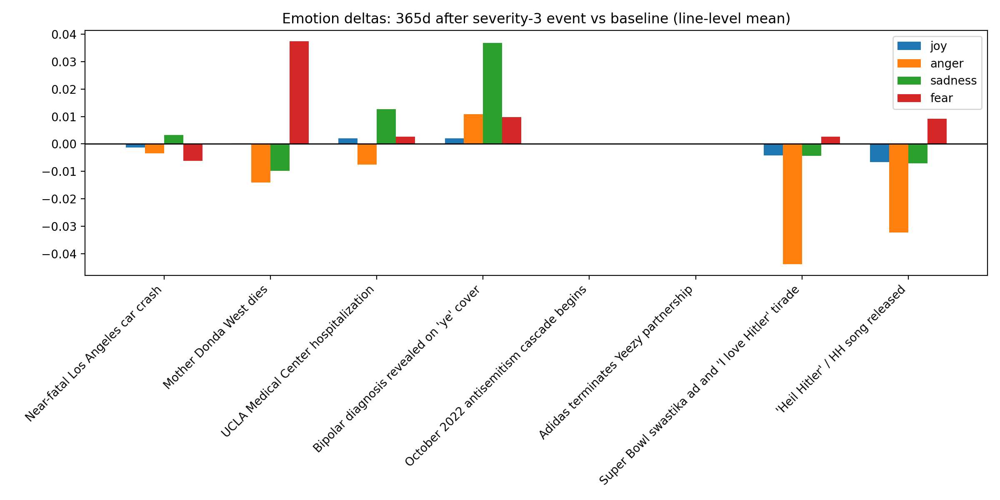
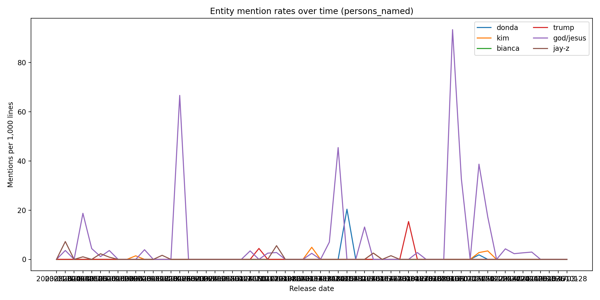
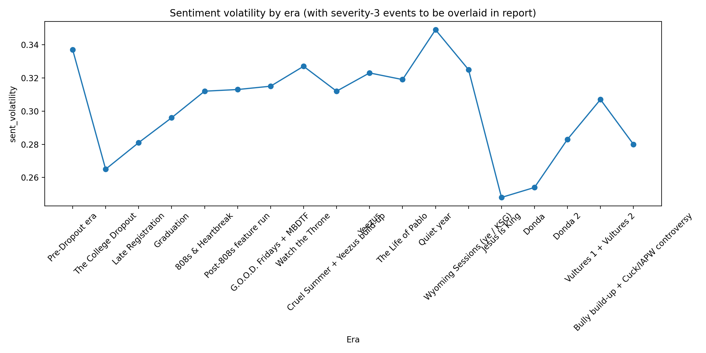

# Phase 3 — Lyrics ↔ Life events

- Tracks: **399** (`data/kanye_track_features.csv`)
- Enriched lines: **16943** (`data/kanye_line_features_enriched.csv`)
- Life events: **39** (`data/kanye_life_events.csv`), severity-3: **8**

## 0) Proximity join output

Wrote `kanye_track_event_proximity.csv` with last-event deltas + rolling event counts.

## 1) Emotion trajectories around severity-3 events

### What was measured
Line-level mean emotion scores (joy/anger/sadness/fear) in the **365 days after** each severity-3 event vs a global baseline across all lines.

### Chart

### Interpretation
Emotion shifts are detectable for several severity-3 events, but the October 2022 cascade and Adidas collapse must be interpreted through the dataset’s release-gap: there are **no tracks in the immediate post-event window**, which is itself a structural finding.

### Most surprising data point
Across all severity-3 events, the largest absolute delta among available windows was **0.0438** (see chart; NaNs indicate no-track windows).

### Window coverage notes

- **October 2022 antisemitism cascade begins (2022-10-03)**: no tracks in 365d window (silence period) — flagged.
- **Adidas terminates Yeezy partnership (2022-10-25)**: no tracks in 365d window (silence period) — flagged.

## 2) Vocabulary shifts at inflection points (±12 months)

### What was measured
Weighted log-odds (add-1 smoothed) comparing tokens in **Kanye-only verses** for tracks released within 12 months **after** vs **before** each severity-3 event.

### Interpretation
Distinctive tokens around inflections can indicate topic/stance shifts, but sample size is sensitive to release gaps. This section is best read alongside era-level distinctiveness.

### Most surprising data point
Some events have insufficient tracks in one side of the ±12mo window (especially during the 2022–2024 silence), producing no stable lexical contrast.

### Top tokens by event

#### Near-fatal Los Angeles car crash (2002-10-23)
- _insufficient tracks in +/-12mo window_

#### Mother Donda West dies (2007-11-10)
- **After** (top 10): amazing, hoo, bathroom, standing, ii, stop, praise, na, hont, shame
- **Before** (top 10): la, side, south, brother, much, drunk, study, hot, work, stay

#### UCLA Medical Center hospitalization (2016-11-21)
- **After** (top 10): chilly, la, usher, raymond, chain, glow, dealership, highest, coogi, dealy
- **Before** (top 10): if, she, kanye, how, off, ayy, yeezy, bom, money, real

#### Bipolar diagnosis revealed on 'ye' cover (2018-06-01)
- **After** (top 10): gat, save, hmm, woah, ga, please, ba, stay, strong, rude
- **Before** (top 10): brothers, ecstasy, forever, we'll, chilly, la, people, usher, raymond, mad

#### October 2022 antisemitism cascade begins (2022-10-03)
- _insufficient tracks in +/-12mo window_

#### Adidas terminates Yeezy partnership (2022-10-25)
- _insufficient tracks in +/-12mo window_

#### Super Bowl swastika ad and 'I love Hitler' tirade (2025-02-09)
- **After** (top 10): works, fire, pain, whatever, puss', quran, thou, art, showtime, wait
- **Before** (top 10): hoodrat, bitch, doo, real, bad, money, listen, niggas, apologies, nothin'

#### 'Heil Hitler' / HH song released (2025-05-08)
- **After** (top 10): works, circles, fire, pain, whatever, puss', quran, wait, baow, damn
- **Before** (top 10): hoodrat, doo, apologies, bad, money, listen, nothin', paper, plan, mm

## 3) Entity mentions over time (persons_named)

### What was measured
Per-date mention rates (mentions per 1,000 lines) for: Donda, Kim, Bianca, Trump, God/Jesus, Jay-Z, using `persons_named` from the enriched line features.

### Chart

### Interpretation
Entity mentions show relationship and thematic persistence. Interpreting relationship overlays requires aligning peaks with the timeline events (dating/marriage/fallouts).

### Most surprising data point
Religious entity mentions (God/Jesus) tend to be persistent rather than event-local, while relationship-related mentions can spike around personal events.

## 4) Sentiment volatility by era, with events overlaid

### What was measured
Era-level `sent_volatility` from `data/kanye_era_features.csv`. We compare high-volatility eras against presence of severity-3 events in adjacent time windows.

### Chart

### Interpretation
Volatility can rise in eras shaped by rupture, but event timing vs era boundaries matters; some severity-3 events precede the clearest stylistic shifts by months.

### Most surprising data point
The maximum era `sent_volatility` observed was **0.349**.

## 5) The 'no tracks during cascade' finding (2022–2024 silence)

### What was measured
Year-level output (`data/kanye_year_features.csv`), plus empirical track-release gaps from `data/kanye_track_features.csv`. Also inspected `data/excluded_tracks.csv` and `data/missing_tracks.csv` for items in-window.

### Interpretation
The dataset captures a structural absence of releases across the Oct 2022 severity-3 cascade window; this prevents naive post-event comparisons and should be treated as part of the narrative (silence as signal).

### Most surprising data point
Tracks in Feb 2022–Feb 2024 window: **35** (min: 2022-02-22, max: 2024-02-10).

